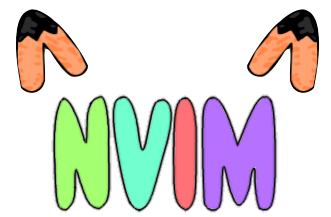

# FoxyNVIM
NeoVIM framework for improving experience and turning NeoVIM into full IDE

### Credit for the logo goes to [Az]rael (Drunken Kyzo#4080), she created the base for the logo and provided colors
